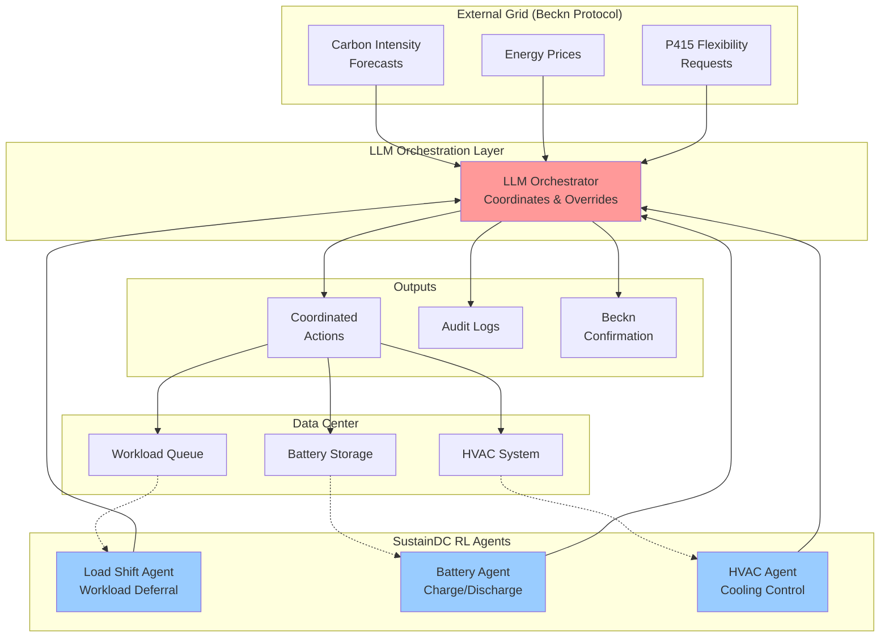

# DEG Compute Orchestrator

> LLM-orchestrated data center optimization for grid flexibility via Beckn Protocol

**Team ThermoTrace** | DEG Hackathon 2025 - Problem 2: Compute–Energy Convergence in a DEG World

---

## Overview

This project enables data centers to participate in grid flexibility markets by adding an **LLM orchestration layer** on top of multi-agent reinforcement learning control systems. We coordinate workload deferral, battery storage, and HVAC operations in response to carbon intensity forecasts and grid signals via **Beckn Protocol**.

### The Problem

Data centers consume 2.5% of UK electricity today, projected to reach 6% by 2030. Each large facility uses power equivalent to 100,000 households. As AI workloads grow, data centers need to:
- Minimize cost per inference under carbon intensity caps
- Participate in flexibility markets (UK P415)
- Coordinate complex subsystems (compute, cooling, storage)
- Provide auditable decisions for regulatory compliance

### Our Solution

We fork [HP Labs' SustainDC](https://github.com/HewlettPackard/dc-rl) benchmark and add:
1. **LLM Orchestrator** - Coordinates three RL agents with external grid signals
2. **Beckn Protocol Integration** - Enables grid communication and P415 participation
3. **Audit Trail System** - Natural language explanations for every decision

## Architecture

### Key Components

**SustainDC Foundation (HP Labs)**
- Three specialized RL agents optimizing different data center subsystems
- Load Shift Agent: Minimizes workload delay costs
- Battery Agent: Optimizes energy storage usage
- HVAC Agent: Balances cooling energy with temperature limits

**The Coordination Gap**
- Agents observe only local state (workload queue, battery SoC, temperature)
- Cannot see external grid signals or market opportunities
- Optimize locally without system-wide coordination

**Beckn Grid Interface**
- Receives carbon intensity forecasts (UK Carbon Intensity API)
- Gets energy prices and P415 flexibility requests
- Publishes available deferrable capacity via Beckn catalog endpoints

**LLM Orchestrator**
- Reads both agent decisions AND external grid signals
- Detects conflicts (e.g., running workloads during high carbon periods)
- Identifies opportunities (P415 payments > deferral costs)
- Generates natural language audit trails for P415 settlement

## Impact

### Financial Benefits
- **Revenue**: P415 payments up to £3,000/MWh during grid stress
- **Cost Savings**: 15-35% reduction in energy bills through load shifting
- **Example**: Large data center (£36M annual energy cost) saves £5-12M/year

### Environmental Impact
- **Carbon Reduction**: Shifting 30% of workload from high-carbon (270 gCO2/kWh) to low-carbon windows (28 gCO2/kWh) cuts 21,780 tonnes CO2 annually
- **Equivalent**: Removing 4,700 cars from roads per data center

### Grid Benefits
- **Infrastructure Savings**: UK's 10-12 GW flexibility target by 2030 avoids £5-6 billion in peaker plant construction
- **Renewable Integration**: Absorbs solar/wind oversupply without curtailment

## References

### Foundation
- **SustainDC**: HP Labs' Multi-Agent RL Benchmark for Sustainable Data Centers  
  GitHub: https://github.com/HewlettPackard/dc-rl

### Data Sources
- **UK Carbon Intensity API**: https://carbonintensity.org.uk
- **Beckn Protocol**: https://becknprotocol.io

### Regulatory Context
- **Ofgem P415**: Virtual Load Profile for Demand Response  
  https://www.ofgem.gov.uk/publications/direction-modify-balancing-and-settlement-code-p415-virtual-lead-parties

## License

This project is released under the **MIT License**.

### Our Contribution
All original work (LLM orchestrator, Beckn integration, audit logging) is MIT licensed.

### Foundation Work
Built on [SustainDC](https://github.com/HewlettPackard/dc-rl) by HP Labs (MIT License). We extend their three-agent system with coordination capabilities.

### Third-Party Components
- SustainDC benchmark suite (HP Labs, MIT License)
- Beckn Protocol specifications (Open standard)
- UK Carbon Intensity API (Public data)

---

**Built for DEG Hackathon 2025** | Problem 2: Compute–Energy Convergence in a DEG World
